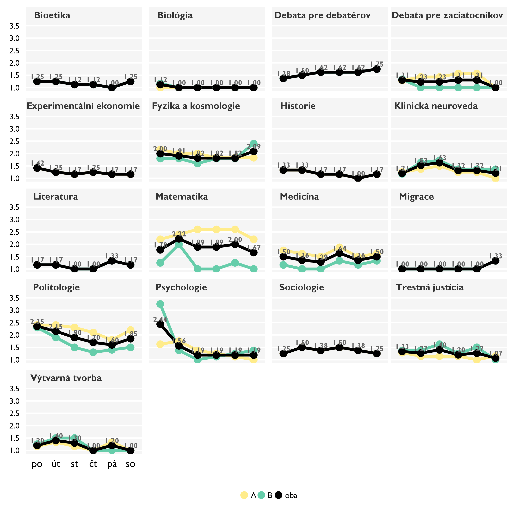
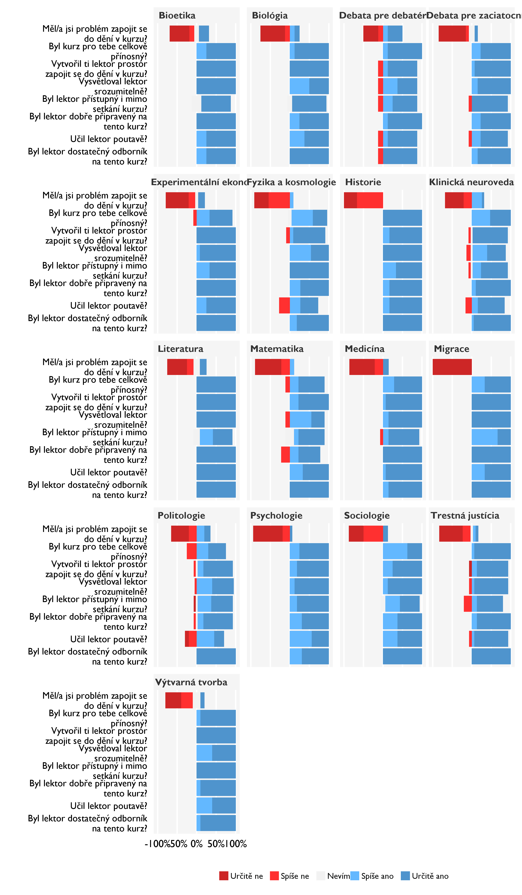
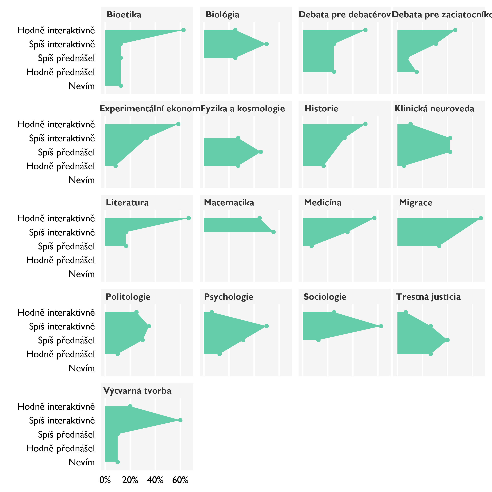
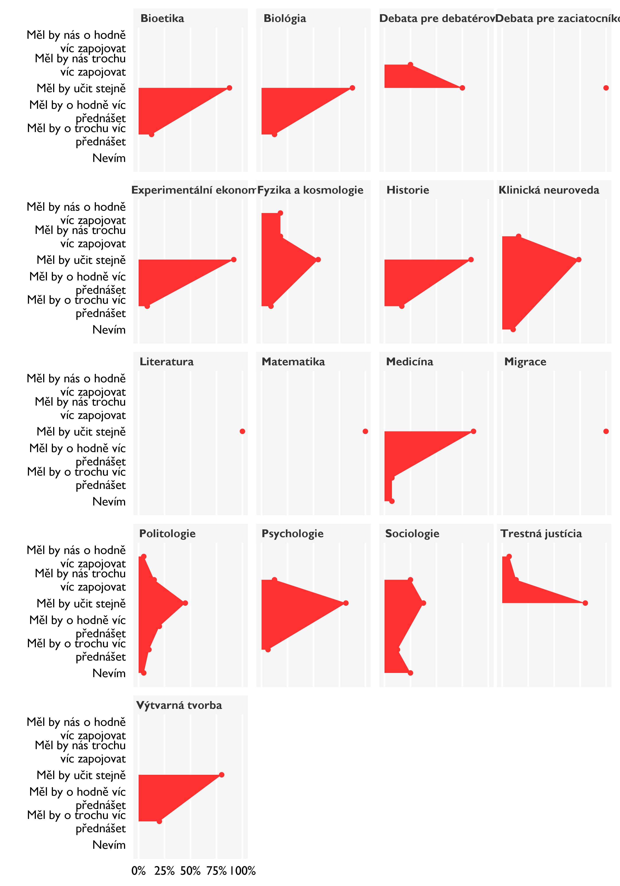
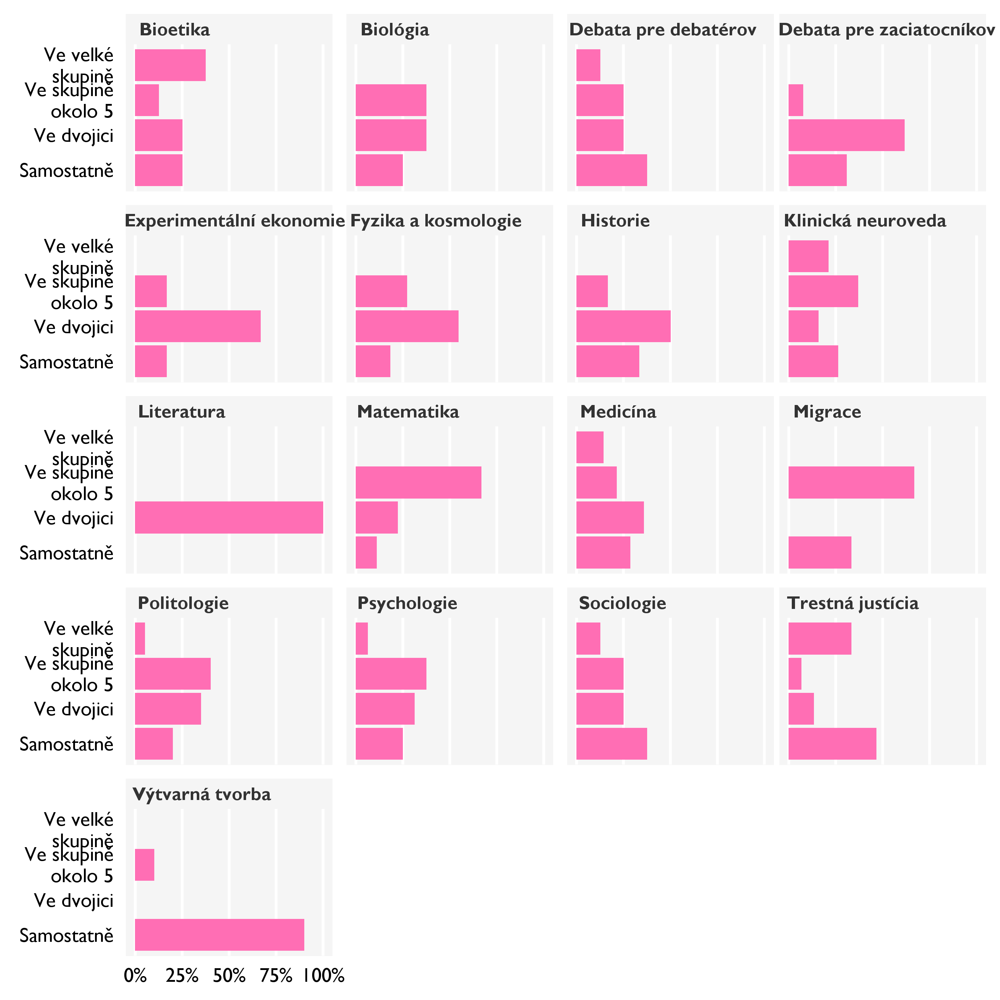
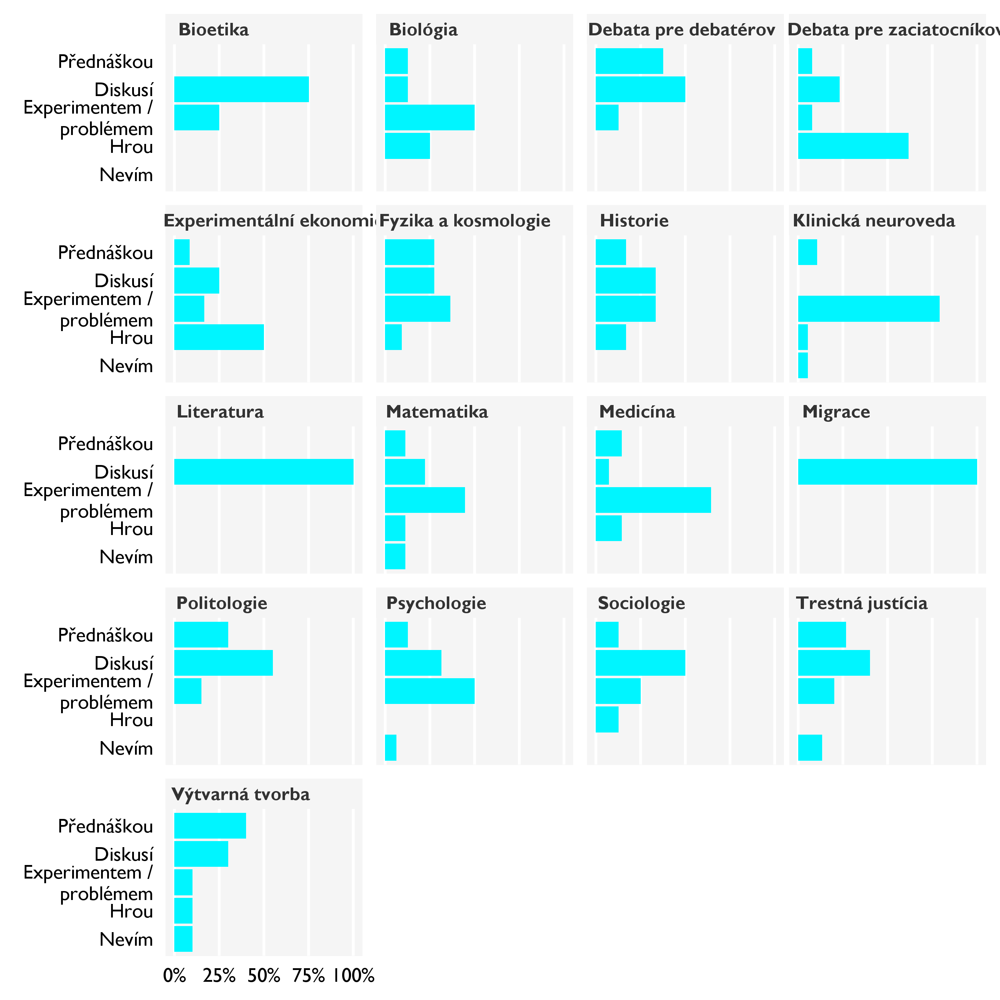
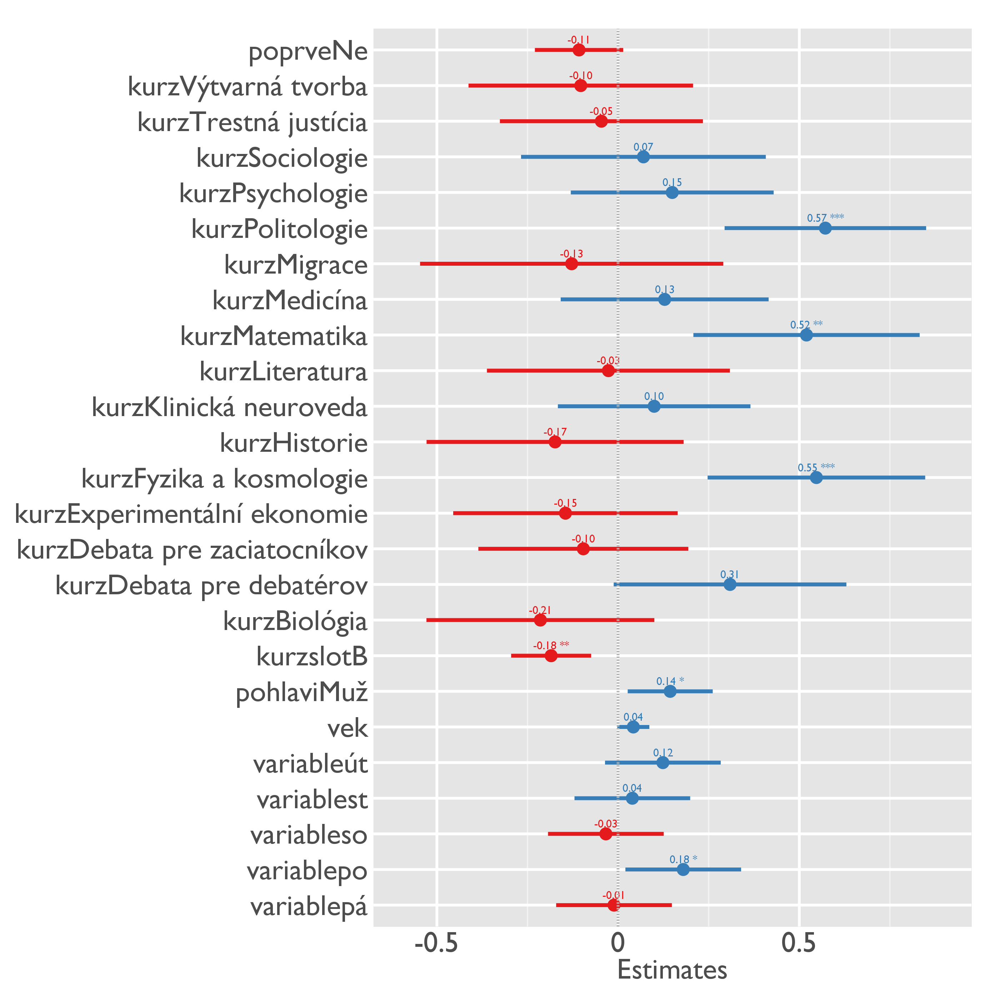

Zpětná vazba Discover 2015 júl: srovnání kurzů
==================

----------

Ke každému kurzu je na Google Drive k dispozici samostatný soubor s detailními výsledky včetně slovní zpětné vazby.

# Hodnocení kurzů

##  Hodnocení lektora

## Didaktika

### Jak lektor učí

**Co nejlépe vystihuje, jak lektor učí?**

### Přednášky *versus* interaktivita

**Přednášel lektor sám, nebo učil interaktivně?**

### Jak by měli lektoři změnit svůj styl?

**Měl by lektor učit jinak?**

## Náročnost

#### **Jak hodnotíš náročnost...**

### Jak se studentům nejlépe učí?

#### **Jak se ti na kurzu nejlépe pracovalo?**

#### **Jak se ti na kurzu nejlépe učí?**

# Bonus: jak udělat skvělý kurz

