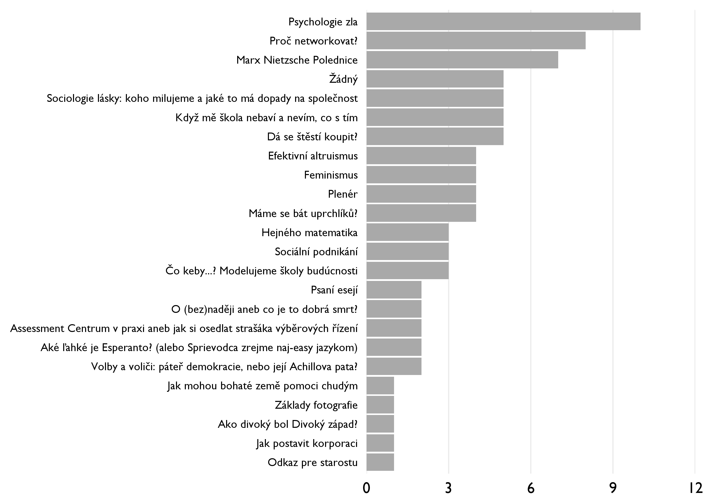
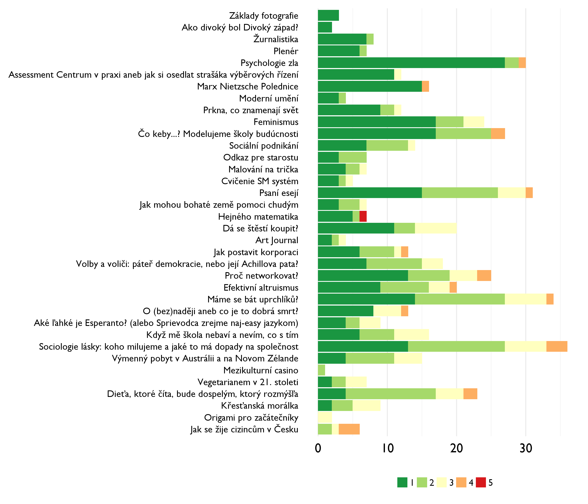
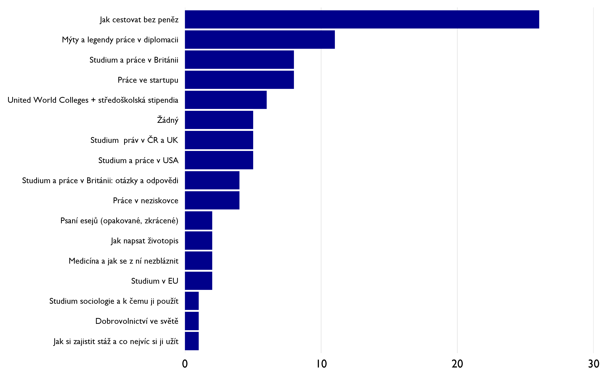
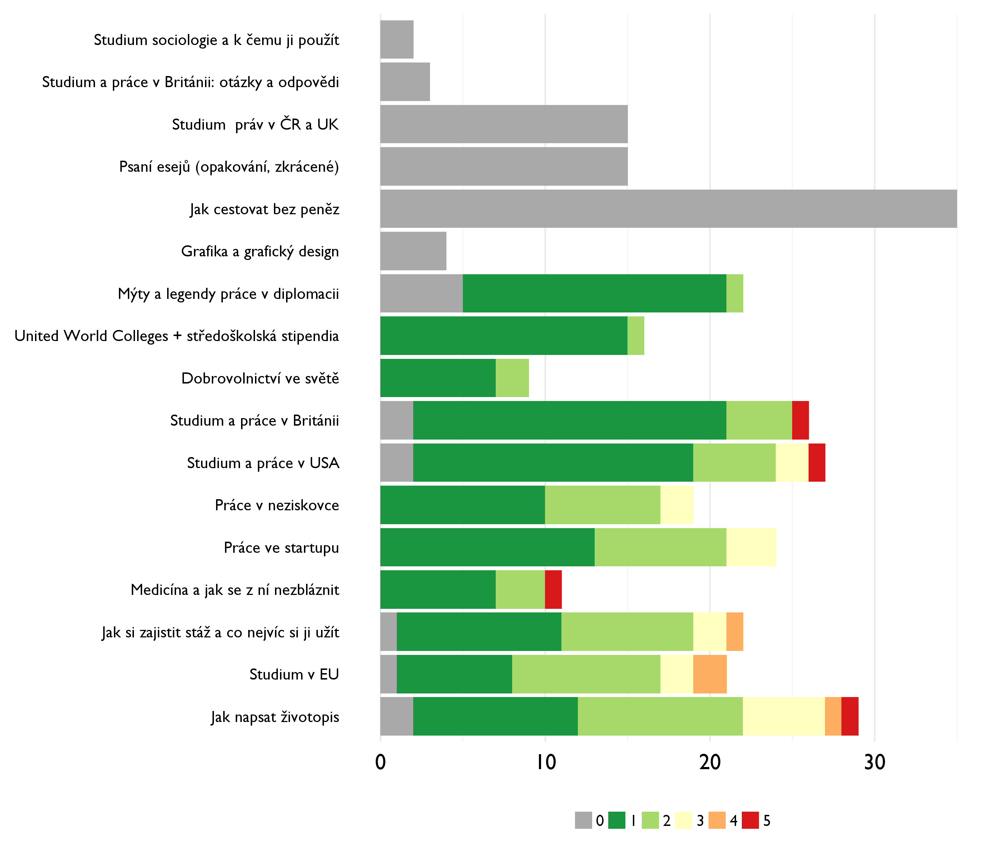

Discover 2015 júl: workshopy, týmy, prefekti
==============
----------

*[Zpět na rozcestník zpětné vazby](index.html)*

# Odpolední workshopy

## Který byl nejlepší?

## Proč?

*coming soon*

## Hodnocení

Nejlépe hodnocené workshopy jsou nahoře. Známky jako ve škole.

----

# Týmové workshopy

## Hodnocení

### **Byly týmové workshopy zajímavé?**

### **Hodnocení týmových workshopů podle předchozí účasti na Discover**

<table style="text-align:center"><tr><td colspan="3" style="border-bottom: 1px solid black"></td></tr><tr><td style="text-align:left">Předchozí účast</td><td>Hodnocení (1=Určitě zajímavé, 5=Určitě nezajímavé)</td><td>Počet účastníků</td></tr>
<tr><td colspan="3" style="border-bottom: 1px solid black"></td></tr><tr><td style="text-align:left">Na Discover nejméně podruhé</td><td>2.52</td><td>24</td></tr>
<tr><td style="text-align:left">Na Discover poprvé</td><td>2.17</td><td>68</td></tr>
<tr><td style="text-align:left">NA</td><td>3.25</td><td>3</td></tr>
<tr><td colspan="3" style="border-bottom: 1px solid black"></td></tr></table>

### Proč ano, proč ne?

### *Komentáře těch, kdo hodnotili spíše pozitivně*

* Boli zaujímavé tým, že som zistila názory ľudí v mojom tíme a mohli sme debatovať o tom, ale asi by som ich dala menej.
* Prefekt (Mojmir) kladol veľmi dobré otázky a vedel priniesť do debaty kontroverziu, nad ktorou bolo zaujímavé rozmýšlať.
* Ukázali nám nový pohled na věci, které by nás jen tak nenapadly.
* Dovolilo nam to ako timu sa spoznat lepsie nez po minule roky a rozoberali sme skvele temy, ktore boli podla mna prinosom pre vsetkych zucastnenych
* Boli zaujímavé pretože sme si mohli vymeniť naše názory na vec a aj sa dozvedieť veľa nových informácií.
* Boli rozhodne zaujímavé lebo v skupinke takých skvelých , vtipných a inteligentných ľudí je radosť vymenienať si názory. :)
* Líbila se mi různorodost lidí a jejich názorů v našem týmu. Bylo zajímavé slyšet rozdílné názory a debatovat o tématech do hloubky.
* Tymove workshopy boli miestami silene, nemali sme sa o com rozpravat. Uvitala by som zaujimavejsie temy, nieco k comu sa mozeme vyjadrit detailnejsie a nieco s cim sa stretavame castejsie.
* Nemôžem povedať, že by boli nezaujímavé, ale asi ma bavili najmenej. Témy, ktoré sme preberali, už mám v podstate opočúvané a nie nutne cítim reálny outcome, ktorý som si z nich vzal. Bolo fajn diskutovať s inými ľudmi takéto spoločenské otázky, počuť ich názory, ale to je asi všetko. Napriek tomu si ale viem predstaviť, že to vie mnoho ľuďom pomôcť, preto by som tieto workshopy skôr ponechal.
* Dostala som niekedy novy pohlad na vec co je prinosne. Debaty vo vseobecnosti pomahaju predchadzat domatizmu. Avsak myslim si ze workshopy su o ttochu prinosnejsie ako timove debaty
* Veľmi ma prekvapil workshop v stredu -Moje místo ve společnosti. Prekvapil ma postoj môjho tými k nižším sociálnym vrstvám. Ich predstava bola, že chudobmý ľudia si za všetko môžu sami a nie sú ochotní učiť aj keď majú možnosť, Kedže pochádzam s rodiny s podpriemerným platom, viem , že to tak nie je. Na tomto workshope som sa citila zle a ako niečo menej.
* Témou a tým, že boli tímové
* Často mi přišli suché a trošku "mainstream", často se o těchto věcech vedou debaty na škole apod., někdy by bylo super něco více nezvyklého, ale na druhou stranu videa TED byla skvělá!
* Boli zaujímavé práve tým, že každý z nás mohol vyjadriť svoj názor a prefektka nás viedla, usmerňovala. Mohli sme spolu zdieľať skúsenosti, názory a rozšíriť obzory.
* Spoznávanie názorov iných a vytváranie si vlastnych
* Rozoberane temy ma nie vzdy zaujali
* Zaujali me hlavne jejich otevreností, se kterou jsme nad citlivými tématy hovorili. Na druhou stranu, pokud človeka daná problematika moc nezajímala, musel to stejne absolvovat.
* Zaujímavé boli svojou pestrosťou. Velmi som si oblúbila svoj tým, takže rozprávanie sa s ním bolo zakaždým príjmné.
* Určítě ano, bylo mozné lépe a hlouběji se v rámci týmu poznat. Líbilo se mi, že jsme měli možnost vyjádřit se v menší skupince. Poznat hodnoty, zázemí spolutýmovníků a vzájemně se inspirovat.
* Pretože sme mali skvelého prefekta, tie chvíle boli vtipné, no zároveň vedeli skvelo informovať plus sme sa zoznámili s ďalšími ľuďmi. 

* Tematikou. 
* Umožnily nám vytvořit si lepší vztah s některými z účastníků
* Ze sme spolu komunikovali a zdielali rozdielne nazory. Velke plus oproti minulemu roku!
* Mozna tym obcas nechtel navazat komunikaci..teda debatu. Jinak to bylo skvele vzdy prolozene vtioem a uzite
* Nevedeli sme na na toe temy dobre sustrediť lebo nie kazdeho tie teny zaujali a ti ludia tam potom vyrušovali a to rozhádzylo celý tým.
* Boli urcite zaujimave, vela som sa dozvedela a urcite si vela odnesiem.
* lebo sme mohli diskutoval o skoro vsetkom a vyjadrit svoj nazor na dane temy. 
* Mali sme skvele diskusie 
* Líbily se mi diskuze. 
* Páčila sa mi diskusia, kde každý musel niečo povedať. Väčšina z tém ma zaujímala a keďže sa stále trošku zdráham lektorov, individuálnejší prístup celkom pomohol. Tiež sa cez diskusie ľudia lepšie poznávajú navzájom, čo je fajn.
* Záleželo na tématu, ale minimálne vyprovokovaly človeka k zamyšlení se.
* Fungovali jako dobrý debatní kroužek.
* Timove workshopy nam pomahali rozvinut si svoj nazor a pohlad na spolocnost. Zaujimave bolo to, ze som postupne prichadzala na urcite odpovede vo svojom zivote. Kedze boli ako druhe myslim si, ze sme boli trocha dost unaveny a horsie sa nam sustredili, ale dobre tema nas prebrala.
* Nezaujímavé - náš prefekt podľa mňa nevedel tú diskusiu viesť, hovorilo sa tam odveci.
* Přišlo mi zajímavé slyšet různé názory a vést podnětné diskuze v trošku komornější atmosféře s členy mého týmu.
* Byly zajimave tim, ze resili neorthodoxi temata z jinych uhlu.
* Mohli jsme v male skupince diskutovat, rict sve nazory a zkusenosti
* Ďakujúc prefektovi týmové workshopy boli zábavné a poučné zároveň.
* Základ tímového workshopu je, prekvapivo, práve tím. Ten mi práve úplne nesedel, možno asi aj vôbec..
* Každý mal možnosť vyjadriť svoj názor na danú tému a podeliť sa s tým s ostatnými.
* Príliš detailné rozprávanie sa
* Niektoré témy boli príliš subjektívne a tak sme nedokázali dojst k záveru, no napriek tomu sme spoznali viac názorov a pohladov na danú tému a to je velkým prínosom.
* Na stredajšom som uvítala úprimnosť v tíme, téma bola zaujmavá. Rovnako by som povzniesla tému slobody prejavu. Skor ako samotné témy (ktoré boli všetky dosť dobré) išlo o dynamiku tímu a  to ako spolu vychádzajú ľudia v týme, ak to moc nevychádzalo tak to proste moc nešlo.
* Tématy, prefekty, členy týmu
* Ked sa vsetci zapajali bolo to velmi zaujimave - pocut nazory ktore mozu byt vcelku nevsedne ale zaroven velmi intelektualne a podlozene faktami.
* Byly zajímavé, akorát já jsem o spoustě věcí měl hodně informací a hlubší názory, zatímco můj tým často nevěděl základní slova, co znamenají, natoř aby o tom měli nějaký názor, takže byko trochu těžké s nimi o něčem mluvit. Tudíž věřím, že pro ně to bylo důležité a potřebné, já se tam trochu nudil. Kdybych si o tom mohl povídat s někým více fundovaným, asi bych by plně spokojený.
* Podla mna bolo velmi dobre ked sa k nam Papi pridal pri jednom workshope pretoze to dava tej diskusii novy rozmer a mali by byvat minimalne 2 lektori pri diskusiach. Vela ludom v nasej skupine Honza svojimi motyvacnymi speechmi pomohol na seba a na spolocnost pozerat z inej perspektivy. 
* pretoze vdaka diskusiii s prefektom a nasimi rovesnikmi sme sa mohli zamysliet aj nad nazormi inych

### *Komentáře těch, kdo hodnotili spíše negativně*

* Debaty nebyli moc produktivní a přišlo mi že neměly nadefinované hranice a určitý směr.
* Přišlo mi to trochu nucené a bylo mi líto, že si nemůžeme workshop číslo 2 volit  - oproti minulému roku tedy byl menší výběr workshopů.
* Workshop ,,Co můžu dělat už ted?" považuji za přínosný, protože jsem se dozvěděla spoustu nových typů, jak bych mohla ve společnosti pomoct. Zatímco workshop ,,Malé zločiny" mi nedal téměř nic, protože jsme probírali věci, které jsou dost jasné, tudíž mi tento workshop přišel poněkud zbytečný. 
* Ne vzdycky me zajimala temata, radsi bych sla na nejaky jiny workshop - nestihla jsem jit na spoustu workshopu, ktere me zajimaly
* Nie. Nebola to chyba prefektka, bol to skôr problém s témami. Vadilo mi, že som nemohol ísť miesto toho na workshop. Nevidím v tývh team workshopoch obohatenie. Ale uznávam, že počúvať názory iných je zaujímavé. Ale o prínose hovoriť nemôžem....
* Boli prílišne organizované, trochu viac voľnosti by nezaškodilo. Mala som pocit, akoby vedúci presne vedeli, aké odpovede na otázky chcú počuť...
* Myslím, že neboli príliš zaujímavé. Prišlo mi, že je nútené rozprávat o témach, ktoré nás nezaujímajú. Myslím, že jeden alebo dvakrát by to bolo dobré, ideálne nie dva dni po sebe a radšej mat dva volitelné workshopy poobede.
* Moc času na něco, co je celkem nuda. Ok, poznáme lidi z týmu, ale pořád nevím, jaké je jejich příjmení, ačkoli znám jejich názor na šikanu.
* Pokud byly někdy zajímavé, bylo to díky prefektovi, který většinou nezajímavá témata dokázal pojmout hodně kontroverzně a udělat je tak o trochu atraktivnější (díky, Mojmíre!)
* Témy ma natoľko nezaujali.
* Diskuze byla nucena, neprirozena a neplodna
* Zlý výber tém podľa mňa.
* Byly zajímavé, protože jsme nebyli rozděleni podle kurzů, nepotkávala jsem ty stejné lidi jako každé dopoledne!
* Ne. Bylo to mrhání časem na předem předvídatelné diskuze.
* Nebyly příliš zajímavé, většina lidí, včetně prefekta, se snažila přesvědčit druhé o svojí pravdě. Někteří účastníci ani nebyli schopni přečíst texty, ale stejně neustále něco komentovali, většinou úplně od tématu. Diskuze se mi tedy nezdály přínosné, protože většina lidí se ani nesnažila zamyslet nad jiným úhlem pohledu a bylo to tedy zbytečné.
* Líbilo se mi, když byla možnost šíření dobré praxe (co kdo dělá za dobrovolnictví, jaké zajímavé fungující občanské aktivity jsou v okolí...)

Naopak mě ubíjelo vyhýbání se "šedým zónám". Co se týče např. malých zločinů, byla by fajn diskuze o tom, co je fajn a co ne. 

## Dopad týmových workshopů

### Změnil se tvůj pohled na některé z témat?

<table style="text-align:center"><tr><td colspan="4" style="border-bottom: 1px solid black"></td></tr><tr><td style="text-align:left"></td><td>Nezměnil</td><td>Změnil</td><td>Celkem</td></tr>
<tr><td colspan="4" style="border-bottom: 1px solid black"></td></tr><tr><td style="text-align:left">Na Discoveru nejméně podruhé</td><td>14</td><td>10</td><td>24</td></tr>
<tr><td style="text-align:left">Na Discoveru poprvé</td><td>20</td><td>48</td><td>68</td></tr>
<tr><td style="text-align:left">Celkem</td><td>34</td><td>58</td><td>92</td></tr>
<tr><td colspan="4" style="border-bottom: 1px solid black"></td></tr></table>

### *Proč se pohled změnil:*

* Politická korektnost - tento pojem jsem před Discoverem neznala.
* Nejvíce mě oslovil první workshop o drobných zločinech. Hlavně fakt, jak hodně jich všichni děláme.
* Díky workshopu ,,Moje místo ve společnosti" jsem si uvědomila, že bych neměla být tolik kritická vůči chudým a nevzdělaným lidem, protože dost často za to nemůžou oni, ale spíše situace a rodina, ze které pochází. 
* Pretože v niektorých prípadoch som si myslel že svet funguje trošku inak ako nám to hovorili prefekti.
* v sratke... počula som naozaj veľa názorov, ktoré by mňa nenapadli a potom čo som ich trocu rozanalyzovala, zmenili,alebo nie, môj názor.
* Politická korektnost
* Uvedomila som si , že nie všetci majú rovnaké morálne hodnoty ako ja, ale neznamená ti že sú horši , ale skôr neinformovaný.
* Zaujal ma hlavne sobotňajší tímový workshop, pretože som netušila že existuje toľko spôsobov využitia voľného času, pomoci druhým a prečo sa to vlastne oplatí.
* Napr. Workshop o štúdiu v Británii ma nabudil aby som sa tam skúsil hlásiť.
* No napríklad ma inšpiroval k aktívnejšiemu prístupu k životu, a rozhodne som iac premýšľala o malých zločinoch, zaujalo ma, že takmer každý z nás mal niečím iný názor. To sa mi páčilo.
* Najviac ma zaujal workshop "moje miesto v spoločnosti", ktoré som si už predtým uvedomovala, no rodičom budem vďačná ešte viac ako som bola.

* Místo ve společnosti - a to nejen díky tomuto workshopu ale i během celého Discoveru jsem postupně jistila, že bohužel rodina a i místo, kde žijeme, nás nějak determinují a omezují. Musíme, proto dělat víc než musí ostatní, ale není nemožné něčeho vysokého dosáhnout.
* Pretože sme získali nové informácie do témy a dlhými debatami sme prišli k novým záverom a myšlienkam, ktoré by nás ako jednotlivca nenapadli. 
* Můj pohled se poněkud změnil například na tzv. elity
* Pri vacsine temat som si rozsirila svoje spektrum vedomosti o vedomosti a zaujimave postrehy inych ludi. 
* Docela áno a vela nových myšlienok si odnášam.
* Zejména poslední workshop o efektivním altruismu (co muzu delat tady a ted) mi dost rozšířil obzory, a možná i ten o nerovnosti ve společnosti. Ostatní mi připadaly jako ztráta času, zejména otázka vtipů, což je téma, které jsem na různých místech probíral už mnohokrát.
* Viac aktivit, ktore mozem robit vo volnom case v ramci dobrovolnictva.
* Jiny pohled na vtipy o romech..
* Mozem nieco zmenit uz teraz? Tento workshop bol pre mna najlelpsi, lebo som sa trochu inspirovala ostatnymi v mimoskolskych aktivitach. A urcite ma to posunulo dalej.
* hlavne rozsirili perspektivu akou som sa pozerala na tie veci a mohla som si na zaklade toho vybudovat viac kriticke myslenie. 
* Možná mě trošku přesvědčil, že politicky nekorektní vtipkování není úplně košer. Jinak mě o všem minimálně přinutily přemýšlet. 
* Neviem či sa zrovna zmenil, skôr ma donútil utvoriť si poriadny názor na niektoré veci, napr. vtipy o rómoch a ako môžu vplývať na spoločnosť.
* Vypočula som si rozne nazory ucastnikov a tym som si mohla rozsirit obzor v konkretnej teme
* Budu se snažit být lepším příkladem a neporušovat pravidla, jako třeba chození na červenou. Díky poslednímu workshopu se také cítím, že dělám pro společnost celkem hodně věcí, i když jsem je před workshopem brala jako samozřejmost. V tomto směru se také budu snažit vylepšovat.
* Ačkoliv si to sám neuvedomuju, menim i svými malými činy svet k lepšímu.
* Malé zločiny, Co můžu dělat už teď.
* Vdaka workshopom som prisla na urcite odpovede na spolocenske otazky. Teraz uz viem aky bol pohlad na disidentov a viem aky velky a vyznamny vplyv maju na terajsiu spolocnost.
* Malé zločiny, viac sa budem zamýšľať, čo teda robím a takisto posledný workshop bol super, zistila som ďalšie oblasti v kt. sa môžem realizovať.
* Nevim, zda bych rekl, ze se mi zmenil ze dne na den pohled na nektere z temat, ale urcite o nich budu jeste v nasledujicich dnech hluboce premyslet.
* Nad niektorými témami som doteraz neuvažovala, takže som začala uvažovať o doležitých veciach.
* Vďaka diskusiám som mala možnosť poyrieř sa na danú problematiku y viacerých strán. Rovnako je veľkým prínosom i náyor kompetentnej osoby lektora.
* Pomahani ve vetsim meritku
* Hlavne sa na tie témy pozerám z viacerích uhlov a viem si vytvoriť lepší názor.
* Uvidela som nové spôsoby, ako možno zmeniť k lepšiemu problémy, s ktorými sa stretávam
* najvic me oslovili male zlociny
* feminizmus, start up, lacne cestovanie, ako pisat esej a zivotopis ... , priblizenie tematu, dokladne vysvetlenie, moznost pytat sa...
* Čo môžem robiť už teraz- uvedomila som si, že i malou dobrovoľníckou prácou môžem pomôcť tým, ktorý to potrebujú najviac.
* Téma bola ,,Malé zločiny" . Uvedomila som si, že to, čo som doteraz považovala za nevinné priestupky mohli mař omnoho horší celkový dopad.
* Malé zločiny, nebrala som túto tématiku vôbec do úvahy a vďaka tomuto workshopu som mala možnost začať o nej premýšlať.
* Dozvedela som sa o nich ovela viac - cim viac informacii tych objektivnejsi pohlad
* Malé zločiny - fakt si promyslet, jestli mi to za to stojí, jestli přinese více škody než užitku neo naopak. Být zodpovdný k sobě i k okolí.
* Pomohlo mi to pozerat sa na socialne slabsich z ineho uhla pohladu. Napriklad ze nemusia byt chudobny len preto lebo su lenivy ale ze to moze byt sposobene tym ze v mladosti nemali ani moznost dostat sa vyssie. 
* aj ano, aj nie

### *Proč se pohled nezměnil:*

* Už jsem měl vydobytý a debatovaný názor na tyto témata před Discoverem
* Záleží na daném tématu. V tomto opravdu nevím. 
* Mala som na témy rovnaký pohľad ako sa rozoberal na workshopoch.
* moje nazory mam zalozene na hodinach premyslania, zalozene na faktoch, takze moje nazory ostali viac menej pevne, no diskusia bola rozhodne obohacujuca a velmi prijemna
* Diskuze nebyla moc zajimava
* Tak mala som zvačša podobné názory ako ostatní členovia.
* Na túto otázku neviem odpovedať, myslím, že moje názory nepresvedčili...
* Temy, ktore sme rozoberali neboli az take kontroverzne a nedozvedela som sa tolko novych informacii, aby bol moj pohlad na ne pozmeneny.
* Pretože sú to veci, na ktoré svoj názor mám a s ktorými som v podstate vysporiadaný.
* Lebo v mnohych veciach sme sa zhodovali a ak nie tak moj pohlad zostal vacsinou rovnaky. Avsak som rada ze som vnimala aj ine nazory
* Hodně často se mi stalo, že všichni krom jednoho měli stejný názor..
* Moj nazor bol rovnaky ako sme si hovorili
* Na všechny témata týmových workshopú jsem už mel nejaký názor, na kterém jsme se v podstate všichni shodli, jelikož jsme meli vlastne všichni relativne podobný.
* Ani nie, ale pochopila som ako sa na danú problematiku dívajú ostatní a to mi určite pomohlo.
* Témata nebyla sama o sobě zrovna zajímavá.
* Jsem hloubavý a dloupavý jedinec, který se nad lecčím už zamýšlel a na leccos si názor již utvořil
* Nedalo mi to nic nove, nic nad cim by som sa nezamyslal pred tym
* ako som pisala aj predtym. par opakujucich sa myslienok stale dookola
* Hodina a půl není dostatečný čas na to, aby člověk přehodnotil stanovisko, které si formuje už nějakou dobu.
* I když se mi diskuze na workshopech líbili, nezaznělo v nich pro mě nic, co by dokázalo,nějakým zásadnějším způsobem,změnit mé stávající názory.
* Jsem konsistentní ve svých názorech
* Jednoducho som sa nestotožnila s veľa inými názormi. 
* Protože si stále myslím, že přecházet na červenou není zločin, pokud tím nikoho neohrozím. Na druhou stranu zajímavé je poslechnout si názor ostatních. 
* Bohužel příliš povrchní, časté vyhýbání se grey zones.

## Máme týmové workshopy změnit? Pokud ano, jak?

<table style="text-align:center"><tr><td colspan="4" style="border-bottom: 1px solid black"></td></tr><tr><td style="text-align:left"></td><td>Neměnit</td><td>Změnit</td><td>Celkem</td></tr>
<tr><td colspan="4" style="border-bottom: 1px solid black"></td></tr><tr><td style="text-align:left">Na Discoveru nejméně podruhé</td><td>7</td><td>17</td><td>24</td></tr>
<tr><td style="text-align:left">Na Discoveru poprvé</td><td>40</td><td>28</td><td>68</td></tr>
<tr><td style="text-align:left">Celkem</td><td>47</td><td>45</td><td>92</td></tr>
<tr><td colspan="4" style="border-bottom: 1px solid black"></td></tr></table>

Tedy: častěji by týmové workshopy měnili ti, kdo už Discover zažili.

### *Co změnit:*

* Zkrátit nebo úplně zrušit. Možná by mohli být více formou přednášek a debatě o nich než začátek z ničeho.
* Omezila bych jejich počet.
* Nedávat jich tolik. První den, kdy byly workshopy, které jsme si mohli vybrat podle sebe mi přišel nejlepší. Tudíž bych týmových workshopů dala příště méně. 
* Udelat je bud kratsi, nebo po veceri, nebo zrusit
* nevím co...
* studenti by se měli přesouvat mezi týmy, aby poznali více jiných studentů a lektoů mimo své kurzy 
* Dať v nich viac voľnosti, nedržať sa textov a videí...
* Ako som hore napísala, trochu skrátiť.
* Temy, sposob vedenia tymoveho workshopu.
* Možno by nemuseli byt tak často. Dva timove workshopy by mohli stačiť. Namiesto nich by som dala viac  tych ,z ktorých sme si mohli vyberať.
* Možno skúsiť loviť nejaké viac prekvapujúce témy, nad ktorými sa mladí väčšinou nezamýšľajú vôbec.
* Skratit urcite. Lepsie to bolo minuly rok ked to bolo takou jednoduchsou formou a nie 1,5 hodiny
* S tímovými workshopmi som bola veľmi spokojná, ale uvítala by som možnosť výberu témy
* Možno by som znížil ich počet.
* Zapojit nejake aktivity - nie iba citanie textu
* Me osobne by se líbilo, kdyby mel tým možnost si vybrat téma workshopu na každý den (dejme tomu tri témata na každý den...
* Spraviť z nich dobrovolné/úplne ich zrušiť
* Mať ich povinne vonku.
* Dávam áno len preto, pretože všetko má priestor na zlepšenie a určite by sa malo skúšať aj niečo nové. 
* Zkrátit je, udělat jich méně. Raději bych šla na některé netýmové workshopy.
* Možná je udělat hravějšími
* viac interakcie
* témata (1. a 3. workshop)
* Nemať ich.
* Viac zabavy, zaujmavejsie temy
* trosicku ich skratit, alebo volit trochu praktickejsie temy.
* Zaujímavejšie témy. Niektoré mi prišli príliš vzdialené a neriešitelne
* Občas bylo málo času.
* Zrusit je nebo vratit zpatky k veceri a po veceri
* Všechna témata nevyhovovala všem a někteří lidé neměli co říct. Volila bych proto trochu lehčí témata, na které by měl každý nějaký názor.
* Více interakce s ostatními týmy.
* Zmeniť výber tém a podobne.
* Temy boli miestami dost tazke a trocha som sa stracala, ale potom som dostala odpovede. Urcite si nemyslim, ze temy by sa mali vyberat. To, ze boli urcene jednym z lektorov je super. 
* Venovať sa viac do hĺbky veciam, nerist len povrch a spoznanie s témou
* Yadať ich ako dobrovolné, nie povinné... témy na nich preberané by mali byť taktiež voliteľné.
* Nedělat je takové dlouhé. Nebo vůbec.
* Video, ukážka ("naživo")- zaujímavosť!
* malo by ich byt menej, a ked uz, tak najprv by mohol byt spolocny uvod ako pri malych zlocinoch, aby sme vedeli o com sa bavime
* Zkrátit, většinu času se diskutovalo od tématu.
* Zmeniť témy.
* Dát ho dobrovolně - mě bavil, ale vím o člověku, který by ten čas využil raději jinak.
* Skusit pridat slovenske alebo menej komplexne clanky - niektori z nasho timu mali problem rozumiet. Komix bol skvely! 
* Možná poskytovat více materiálů z více zdrojů, aby si lidé vytříbili nějaké jednoduchý názor. Více lidi obecně zapojovat, aby to jen neproseděli a nepromlčeli, zvláště ty, co moc nemluví nebo nemají moc říct, protože ti to obvykle potřebují nejvíce.
* Na kazdy workshop minimalne 2 lektori
* Méně otázek a více času na prodiskutování jednotlivé otázky.
* tak o jeden menej a namiest toho normalne workshopy

### *Proč nic neměnit:*

* Líbili se mi a byl jsem s nimi spokojen.
* Více kontroverzní témata... Všichni se shodneme, že zločiny ať malé či velké jsou špatně a přesto je děláme
* Tymove workšopy boli skvele.
* Podla mna množstvo. A možno aj iný výber tém.
* Myslim ze bol dostatocny priestor na diskusiu co bolo super a vsetci sme mohli zdielat svoje nazory. 

----

# Prefekti

*coming soon*

## Hodnocení role

*coming soon*

----
# Večerní (kariérní) workshopy

## Který byl nejlepší?

- workshop o cestování bez peněz byl účastnický (Tomáš Rábek); pár lidí ho spontánně uvádělo i u odpoledních workshopů (!)
- dvě účastnice nebyly ani na jednom večerním workshopu

## Proč?

*coming soon*

## Hodnocení

Nejlépe hodnocené workshopy jsou v grafu nahoře.

Bohužel jsem udělal chybu v dotazníku: sobotní workshopy neměly kolonku na hodnocení. Všem dotčeným se omlouvám! Nějaký odhad jejich popularity se dá udělat srovnáním s grafem nejoblíbenějších workshopů o kousek výš.

