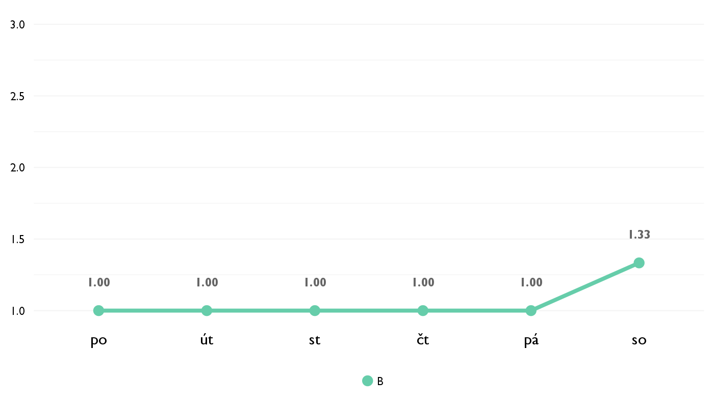
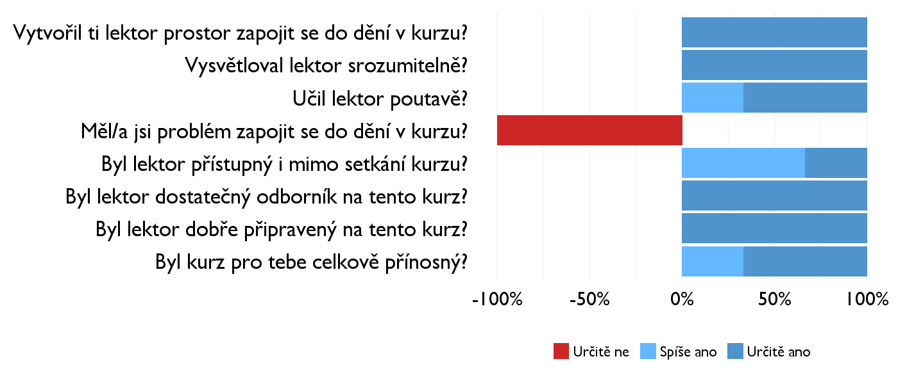
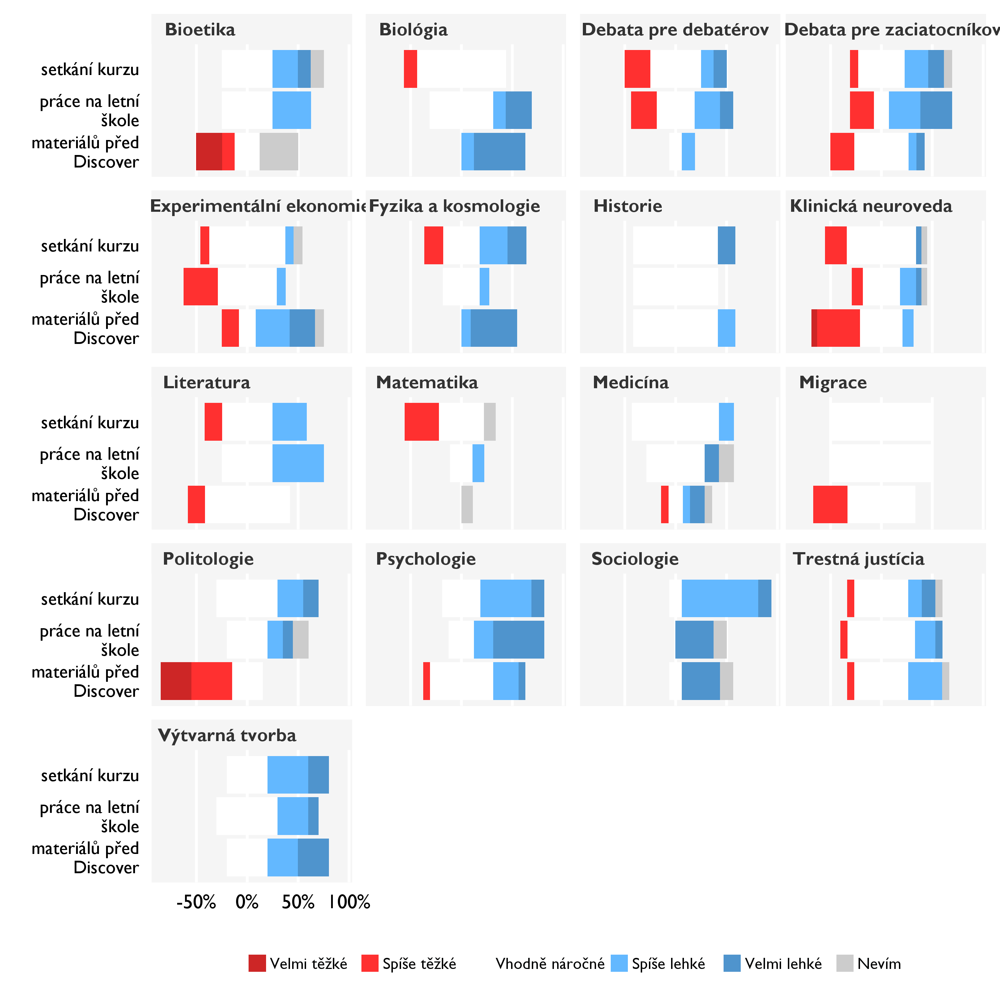
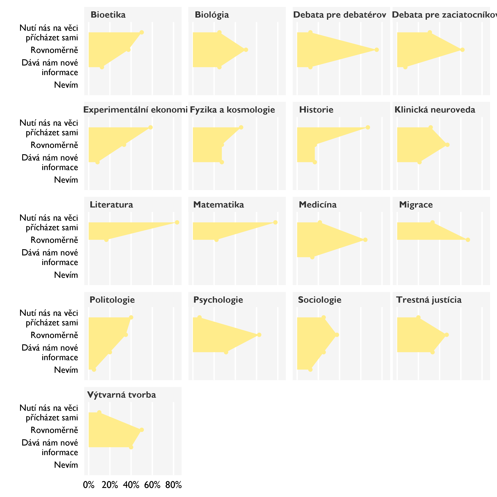
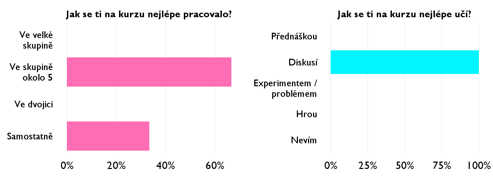

# Migrace

[*Zpětná vazba, júlový turnus Discover*](../index.html)

## Hodnocení kurzu

Průměrná známka: 

|Blok setkání | Průměrná známka|
|:------------|---------------:|
|B            |            1.06|

### Hodnocení po dnech

 

### Co se na kurzu líbilo 

*  Úplne najlepšie bolo si pozriet kúsok z filmu o migrácii v Moldavsku. Bolo to velmi velmi silné! A musím ho dopozerat keď prídem domov. Ale aj všetko ostatné bolo super.

*  Ze sme boli mala skupina a teda bol velky priestor na diskusiu pomocou ktorej sa osobne dokazem naucit najviac. Velmi super hodnotim aj interaktivnost lekcii.

*  Nejvice se mi libil pristup lektorky, ktera nam vse vysvetlila, ale take po nas chtela, abychom nad tim vic premysleli.

### Co na kurzu změnit

*  Nič.

*  -

*  Nemyslim si, ze je treba neco menit.

## Hodnocení lektora

 

### Komentáře k lektorovi 

*  

## Náročnost kurzu

### **Jak hodnotíš náročnost...**

 

## Didaktika

### Jak lektor učí a měl by to změnit?

 

### Jak se studentům nejlépe učí?

 

## Ovlivnil tě kurz nějak?

**Pokud ano, jak? Pokud ne, proč ne?**

*  Nový pohlad na utečencov, chut pomáhat.

*  Rozmyslat o postaveni utecencov a ludi z inych krajin trochu inym sposobom, zvazovat vsetko comu celia etc.

*  Obecne ovlivnil muj pohled na migranty.
